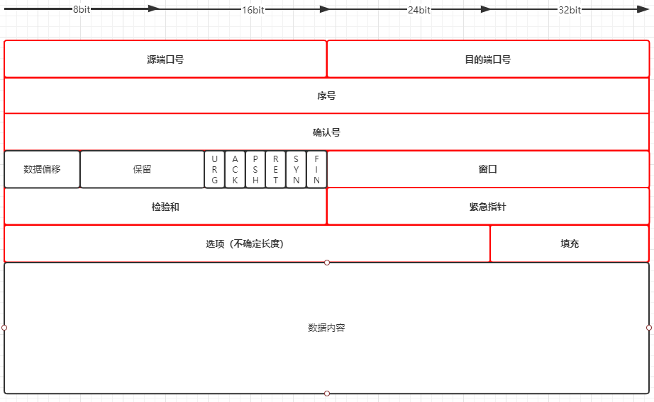

#	网络知识梳理

##	1.TCP/IP

	下一层对上一层而言是透明的，传输在每一层是对等的。

	网络层提供了**主机之间**的逻辑通信；
	运输层提供了**运行在不同主机上的进程之间**的逻辑通信。

-----------

###	应用层

####	DNS		

	DNS协议运行在UDP之上，使用53端口。

	DNS是：
		1.	由分层的DNS服务器实现的分布式数据库；
		2.	使得主机能够查询分布式数据库的应用层协议。

	域名系统，将某一域名映射为对应的IP地址

	解析过程：

		1.	同一台用户主机上运行着DNS英勇的客户端；
		2.	浏览器从上述URL中抽取主机名，并传给客户端；
		3.	DNS客户向服务器发送包含主机名的请求；
		4.	客户最终收到回答报文，其中会包含主机名的IP；
		5.	一旦浏览器接收到来自DNS的该IP地址，向IP地址的80端口发起TCP连接。

#####	名字空间

#####	指针查询

	本地	-》		DNS服务器逐级查找

#####	缓存

	在第一次查询到某个网站的IP之后，将其存储。
	（在有效时间TTL之内）再次访问该域名直接从缓存中读取即可。

	浏览器缓存	->	操作系统缓存	->	DNS服务器递归查询

####	FTP		
	了解。
	
	控制连接+数据连接

####	SMTP	
	
	电子邮件的主要协议，建立在TCP之上。

	组成：
		1.	用户代理	user agent
		2.	邮件服务器	mail server
		3.	简单邮件传输协议	SMTP

	一般直接连接，不经过中转

####	HTTP

	是Web的核心，建立在TCP之上。

#####	报文

	请求：
		请求行	（方法、URL、HTTP版本）
		首部行

#####	请求响应

#####	状态码	
			
#####	web	： 缓存和cookie

cookie：
		1.	在http响应报文中的一个cookie首部行；
		2.	在http请求报文中的一个cookie首部行；
		3.	在用户端系统中保留有一个cookie文件，并由用户的浏览器进行管理；
		4.	位于Web站点的一个后端数据库。

	cookie可以对用户进行标记，简化用户购物等活动。

缓存：
	web缓存器（web cache）也叫代理服务器（proxy server），是能代表初始web服务器来满足http请求的网络实体。

	部署web缓存器的原因：
		*	web缓存器可以大大减少对客户请求的响应时间（尤其是当客户与初始服务器之间的瓶颈贷款远远低于客户与web缓存器之间的瓶颈带宽）；
		*	web缓存器可以大大减少一个机构的接入链路到因特网的通信量。

####	HTTPS
	对HTTP进行了加密

	详细握手过程

-----

###	传输层

	UDP和TCP最基本的责任是将两个端系统之间Ip的交付服务扩展为运行在端系统上的两个进程之间的交付服务。

	**多路分解与多路复用**将主机间的交付扩展到了进程间的交付。

	运输层最低限度的服务：
		1.	进程到进程的数据交付；
		2.	差错检验。

	主机上的每个套接字能够分配一个端口号，当报文段到达主机时，运输层检查报文段中的目的端口号，并将其定向到相应的套接字。

	一个UDP套接字是由一个二元组标志的，包含一个目的IP地址和一个目的端口号。

	一个TCP套接字由一个四元组标志，包含：源IP，源端口，目的IP，目的端口。

####	UDP（用户数据报协议）		
	
	UDP提供不可靠、无连接的服务。只能满足最低限度要求。与IP一样，不可靠。

首部大小：	8字节

#####	优缺点
优点：
	*	关于发送什么数据以及何时发送数据的应用层控制更为精密；
	*	无需连接建立；
	*	无连接状态；
	*	分组首部开销小。

缺点：
	*	缺乏拥塞控制可能导致发送方和接收方之间的高丢包率。

#####	报文结构

	源端口2	目的端口2
	长度2	检验和2
	应用数据4*n

	首部共8字节

#####	差错检验（待补充！）

####	TCP（传输控制协议）

	提供可靠的、面向连接的服务。

	除了满足两点基本要求之外，还提供额外服务：
		可靠传输
		拥塞控制

#####	首部

	

	源端口(16) + 目的端口(16) + 
	序号(32) + 确认号(32) + 
	首部长度(4) + 可选与变长字段(6) + 标志字段(6) + 接收窗口(16) + 因特网检验和(16) + 紧急数据指针(16) + 
	选项(首部长度*32) + 
	数据

#####	连接管理

######	建立连接：三次握手

1. 	客户端发出SYN报文段（不包含数据，SYN标志位置为1，带一个随机选择的初始序号ccc）；
2. 	服务器相应一个SYN ACK报文段（不包含数据，SYN置为1，选择自己的初始序号SSS，ACK置为1，确认字段号为初始序号ccc+1）；
3. 	确认报文段（可以包含数据，SYN为0，ACK为1，确认字为SSS+1）。

完成，连接建立。

######	断开连接：四次挥手

1. 	客户端发出关闭指令：向服务器发送一个报文段(FINbit=1，seq=x )；
2. 	服务器接收到后，回送一个确认报文段（ACKbit=1, ACKnum=x+1）；
3. 	服务器向客户发送FIN报文段(FINbit=1, seq=y)；
4. 	客户收到后对其确认(ACKbit=1, ACKnum=y+1)。

完成，连接释放。

#####	流量控制

	

#####	超时重传

		特点、	
			首部、	
			连接控制	三次握手、四次挥手、同时打开、同时关闭、半关闭
			流量控制	滑动窗口、慢启动、拥塞避免、快速重传和快速恢复
			超时重传（四个计时器）

####	可靠传输原理（待补充！）

-----

###	网络层
	IP提供尽力而为的服务，不可靠。

####	IP

#####	首部

#####	分片	

#####	路由表

####	ICMP

#####	报文格式

#####	查询、查错

-----

###	链路层
	
####	以太网帧格式 
	
####	MTU

####	ARP
			缓存

####	RARP

-----

##	面试常见问题

